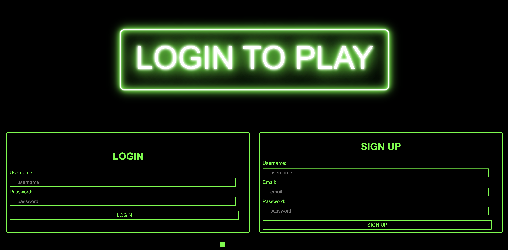

# mini-games
An application for users to play minigames. 

## Installation

If you'd like to test changes, clone the repository to your local machine. Run the command npm init -y to set up the npm package. You can run npm install to be sure all the dependencies have been added. Create your own .env file using the .env.EXAMPLE as a guide. Be sure to run MySQL and add the database. After you've made any changes, save and run npm start or node server.js to start the server. 

## Usage

To begin, either sign up or login. This will bring you to the page with the links to all existing agmes. Click on the desired game. On that page, you may follow the instructions to play the game. Once you are finished, you may log out or return home to choose a new game.

Link to the [deployed application](https://mini-games-5df9d3c11dc2.herokuapp.com/).

Feel free to view our [presentation](https://docs.google.com/presentation/d/1uXGAsZX1iox5nNKlR4yhMaLiMzbcKpC1bY6TUNqmsoA/edit?usp=sharing).

## Technology Used

Our team used HTML, JavaScript, CSS, Node.js, Express.js, Handlebars.js, MySQL, Sequelize, Anime.js, p5.js, etc. on this project. 

## Credits
The code for this web application was written by our team! All contrubutors are viewable in this GitHub repository.

## License

Please refer to the license in the repo.